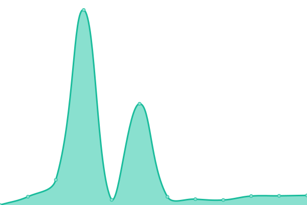

# [📈 Live Status](https://armadillu.github.io/upptime): <!--live status--> **🟧 Partial outage**

This repository contains the open-source uptime monitor and status page for [Oriol Ferrer Mesià](http://uri.cat), powered by [Upptime](https://github.com/upptime/upptime).

With [Upptime](https://upptime.js.org), you can get your own unlimited and free uptime monitor and status page, powered entirely by a GitHub repository. We use [Issues](https://github.com/armadillu/upptime/issues) as incident reports, [Actions](https://github.com/armadillu/upptime/actions) as uptime monitors, and [Pages](https://armadillu.github.io/upptime) for the status page.

<!--start: status pages-->
<!-- This summary is generated by Upptime (https://github.com/upptime/upptime) -->
<!-- Do not edit this manually, your changes will be overwritten -->
<!-- prettier-ignore -->
| URL | Status | History | Response Time | Uptime |
| --- | ------ | ------- | ------------- | ------ |
|  [uri.cat](https://uri.cat) | 🟩 Up | [uri-cat.yml](https://github.com/armadillu/upptime/commits/HEAD/history/uri-cat.yml) | 

 1475ms
     
 | 

<a href="https://armadillu.github.io/upptime/history/uri-cat">100.00%</a>
    

|  miniTerm Sant Feliu | 🟥 Down | [mini-term-sant-feliu.yml](https://github.com/armadillu/upptime/commits/HEAD/history/mini-term-sant-feliu.yml) | 

 2945ms
     
 | 

<a href="https://armadillu.github.io/upptime/history/mini-term-sant-feliu">98.79%</a>
    

<!--end: status pages-->

[**Visit our status website →**](https://armadillu.github.io/upptime)

## 📄 License

- Powered by: [Upptime](https://github.com/upptime/upptime)
- Code: [MIT](./LICENSE) © [Oriol Ferrer Mesià](http://uri.cat)
- Data in the `./history` directory: [Open Database License](https://opendatacommons.org/licenses/odbl/1-0/)
